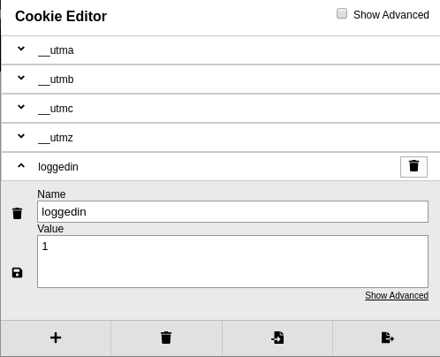

On vising the site we are greeted with

```
Access denied.
```

Now how does the website know if I am logged in or not. It had to store that state somewhere. One of such place is a 'Cookie'.  Use a [cookie editor extension](https://chrome.google.com/webstore/detail/cookie-editor/hlkenndednhfkekhgcdicdfddnkalmdm/related?hl=en) and once you open the site, you will see there is a cookie named `loggenIn` and has a value 0. Change that to 1, save it and refresh the page, you will get the passwd



**passwd :** `aGoY4q2Dc6MgDq4oL4YtoKtyAg9PeHa1`