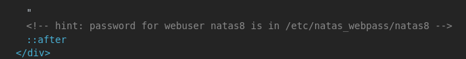

This is an example of Directory traversal and Code Injection Attack.
Read about it [here](https://www.acunetix.com/websitesecurity/php-security-2/)

If you inspect the page there is a hint where it specifies where the passwd is.

Also if you look into the hyper links it is evident it fetches those pages and renders them. So, if we feed our own file there it will render those as well. 

So change the link to this. `http://natas7.natas.labs.overthewire.org/index.php?page=/etc/natas_webpass/natas8` And you will get the password. 

**passwd :** `DBfUBfqQG69KvJvJ1iAbMoIpwSNQ9bWe`

