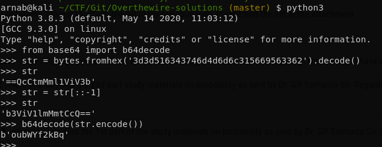

Again we have the source code

```php
$encodedSecret = "3d3d516343746d4d6d6c315669563362";

function encodeSecret($secret) {
    return bin2hex(strrev(base64_encode($secret)));
}

if(array_key_exists("submit", $_POST)) {
    if(encodeSecret($_POST['secret']) == $encodedSecret) {
    print "Access granted. The password for natas9 is <censored>";
    } else {
    print "Wrong secret";
    }
}
```

All we have to do is to decode the encodedSecret. If we look at the steps

secret --> base64 encoded --> reversed --> hex

Now since all the base64 is symmetric encoding we can reverse the entire encoding process. I used python to 
1. Decode the hex to string
2. Reverse the string
3. Decode the base64



Enter that in the form and you will get the passwd

**passwd :** `W0mMhUcRRnG8dcghE4qvk3JA9lGt8nDl`
